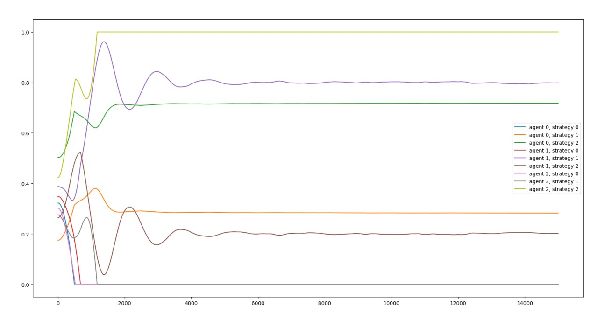

## Description

A programe approximating Nash equilibrium of a randomly-generated small game, based on the article "Sample-based Approximation of Nash in Large Many-Player Games via Gradient Descent"

## Result

## TODO
- [ ] Visualize large many-player games.
- [ ] Switch to a convergent algorithm for games with small number of players.
